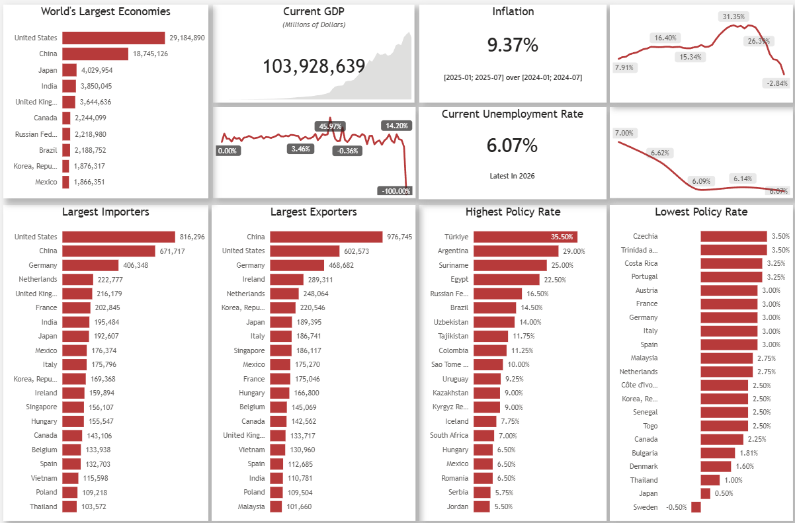
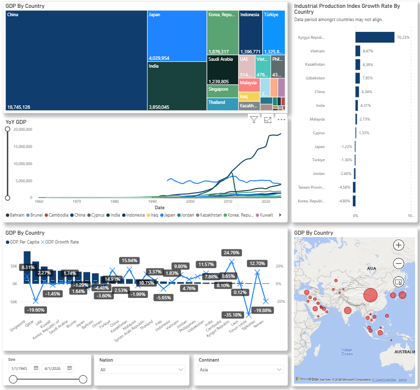
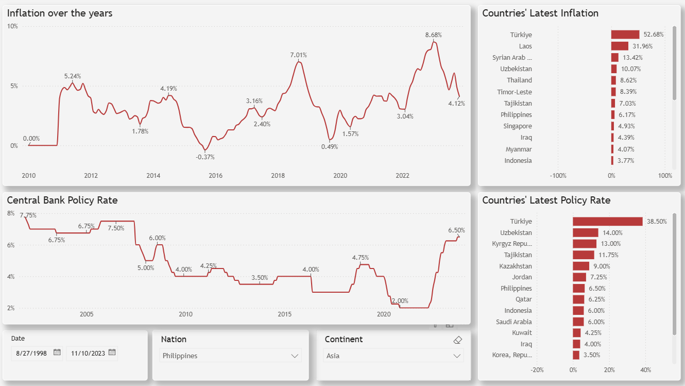
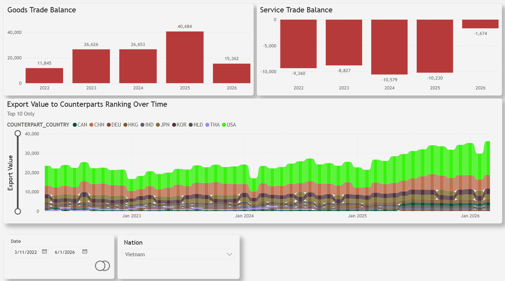

# World Economy Monitor — Global Macroeconomic Dashboard

This project tracks **core macroeconomic indicators across ~100+ countries**, organized into **4 pillars**, through a Python/Jupyter ETL pipeline (`source.ipynb` + `utils.py` + `config.py`) feeding a Power BI report (`World Economy Monitor.pbip`).

---

## Framework Overview (4 Pillars)

Data is sourced from two pipelines — **DBnomics** (`dbnomics` Python package, a free aggregator mirroring IMF/OECD/BIS series) and the **direct IMF API** (`api.imf.org`, SDMX 3.0), used where DBnomics' mirror has gaps or lag. The direct API requires a free key from `portal.api.imf.org`, stored in `.env` as `IMF_API_KEY` (see [Setup](#setup)).

| Pillar | Focus | Goal | Indicators | Data Source |
| :--- | :--- | :--- | :--- | :--- |
| **Pillar 1** | System Health & Growth | Identify the economic cycle (expansion vs. recession) | Real GDP (local currency, converted to USD)<br>Industrial Production Index (IPI) | DBnomics `IMF/IFS` (`NGDP_XDC`) merged with `IMF/IFS` exchange rate (`EDNA_USD_XDC_RATE`)<br>IMF API `IMF.STA:PI` (`IND`), falling back to DBnomics `IMF/IFS` (`AIP_IX`) for the ~15 countries the IMF PI dataflow doesn't cover (e.g. UK, Belgium, Sweden) |
| **Pillar 2** | Inflation & Monetary Policy | Track price pressure and investment flow direction | Headline Consumer Price Index (CPI)<br>Central Bank Policy Rate | DBnomics `IMF/CPI` (`PCPI_IX`, monthly)<br>IMF API `IMF.STA:MFS_IR` (`MFS166_RT_PT_A_PT`, broadest country coverage), falling back to DBnomics `BIS/WS_CBPOL` for countries MFS_IR doesn't report individually (Eurozone members — ECB sets one shared rate — plus UK, Saudi Arabia, Kuwait) |
| **Pillar 3** | Labor & Consumption | Assess real consumer purchasing power | Unemployment Rate<br>Retail Sales Growth<br>Population *(added — used for per-capita metrics)* | DBnomics `IMF/WEO:latest` (`LUR`, % of total labor force)<br>DBnomics `OECD/MEI` (`SLRTTO02`, monthly retail trade value)<br>IMF API `IMF.RES:WEO` (`LP`), includes forecast years alongside actuals |
| **Pillar 4** | Trade & Supply Chain | Measure trade flows and geopolitical shocks | Merchandise Imports / Exports<br>Trade in Services *(added)*<br>Global Manufacturing PMI<br>Commodity Price Index | IMF API `IMF.STA:IMTS` (exports `XG_FOB_USD`; imports try `MG_FOB_USD`, fall back to `MG_CIF_USD` per-country) — fetched bilaterally by real ISO3 counterpart country and summed, avoiding regional aggregate codes (`G001`, `GX170`, etc.) that would double-count totals. Migrated from DBnomics' `IMF/DOT` mirror, which only had usable coverage for ~6 countries<br>IMF API `IMF.STA:BOP` (indicator `S`, credits `CD_T` / debits `DB_T`), quarterly, evenly split into monthly<br>DBnomics `OECD/MEI` (`BSCICP02`, Business Confidence Index)<br>Not yet implemented (placeholder cell only) — planned source: World Bank Pink Sheet or IMF `IFS`/PCP via DBnomics |

### Supplementary Data (outside the 4-pillar framework)

* **US Deep-Dive**: CPI, Unemployment Rate, Nonfarm Payrolls, Real GDP, Manufacturing Investment — sourced directly from **FRED** (Federal Reserve Economic Data) via `pandas_datareader`.
* **Country Reference Data**: country/continent mapping built locally from `config.py` (`dict_2_char`/`dict_3_char`, ~108 countries) — no external API. Continent is assigned offline via the `pycountry_convert` library, with manual overrides for the handful of codes it doesn't recognize (historical entities like the former USSR, special territories).

---

## Setup

1. Install dependencies: `pandas`, `dbnomics`, `requests`, `python-dotenv`, `pycountry-convert`, `pandas_datareader`, `matplotlib`.
2. Register a free account at `portal.api.imf.org`, subscribe to the Data API product, and get your subscription key.
3. Create a `.env` file in the project root (already git-ignored):
   ```
   IMF_API_KEY=your_key_here
   ```
4. Run `source.ipynb` top to bottom to regenerate all CSVs under `data/`.

---

## Power BI Report (`World Economy Monitor.pbip`)

The report has 9 pages: 5 content pages and 4 drill-through tooltip pages.

| Page | Description |
| :--- | :--- |
| **Overview** | A top-down global snapshot — headline KPIs (GDP, CPI, unemployment, policy rate, trade, industrial production, retail sales) blended across all tracked countries, with current-vs-previous month/year comparisons. The starting point for reading the state of the world economy at a glance. |
| **Economic Growth** | Compares GDP levels and growth rates across countries and time — map, treemap, and per-capita/growth combo chart — to surface which economies are expanding, contracting, or over/under-sized relative to population. |
| **Inflation & Monetary Policy** | Places inflation (YoY CPI) and central bank policy rates side by side, by country and over time, to see how monetary policy is responding to price pressure. |
| **Labor & Consumption** | Reads consumer-side health through unemployment and retail sales trends alongside population, to gauge real purchasing power and labor market slack. |
| **Global Trade** | Breaks merchandise and services trade apart — goods vs. services trade balance by year, plus a ribbon chart of top trading partners over time — showing what the combined trade figures on Overview hide. |
| **GDP_Tooltip** | Drill-through table: GDP by country, for detail lookups from other pages. |
| **YoY_GDP_Tooltip** | Drill-through line chart: a selected country's GDP trend over years. |
| **MoM_policyrate_Tooltip** | Drill-through line chart: a selected country's policy rate trend over years. |
| **Country_IPI_Trend_Tooltip** | Drill-through line chart: a selected country's industrial production index trend. |

### Sample Screenshots

**Overview**


**Economic Growth**


**Inflation & Monetary Policy**


**Global Trade**


### Semantic Model

Key fact tables loaded into the model: `f_gross_domestic_product`, `f_industrial_production_index`, `f_consumer_price_index`, `f_cb_policy_rates`, `f_unemployment_rate`, `f_retail_sales`, `f_PMI`, `f_trade_balance`, `f_imf_imports_goods`, `f_imf_exports_goods`, `f_imf_imports_services`, `f_imf_exports_services`, `imf_population`, plus `d_country` and `d_calendar` as dimension tables and a central `Measures_Table` for DAX measures.
